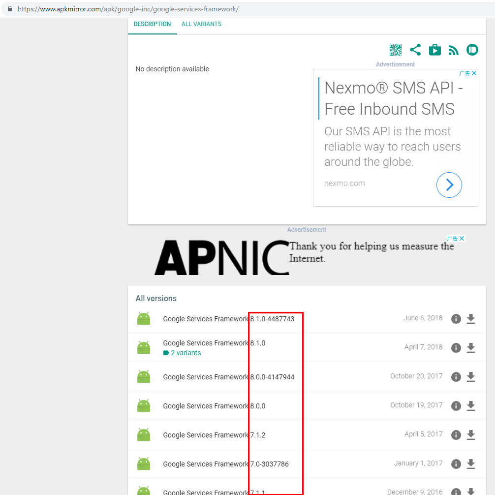
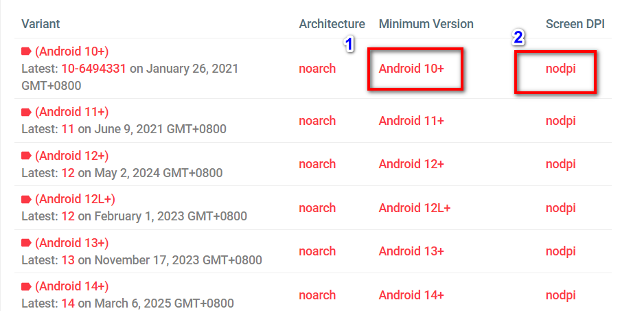
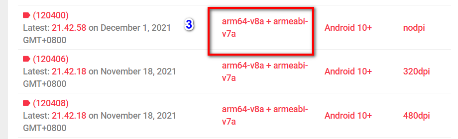
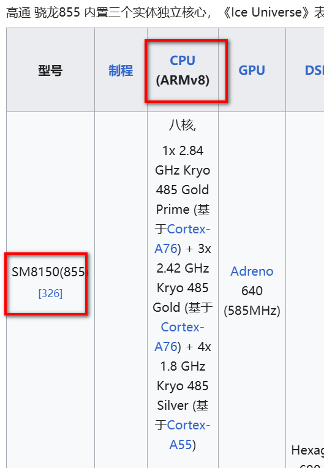
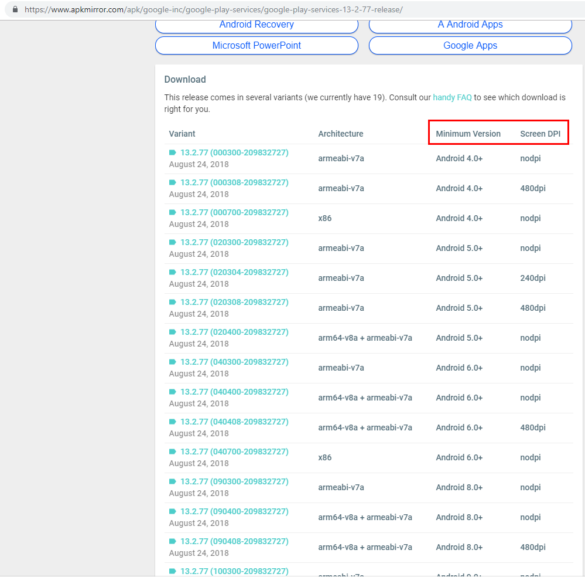
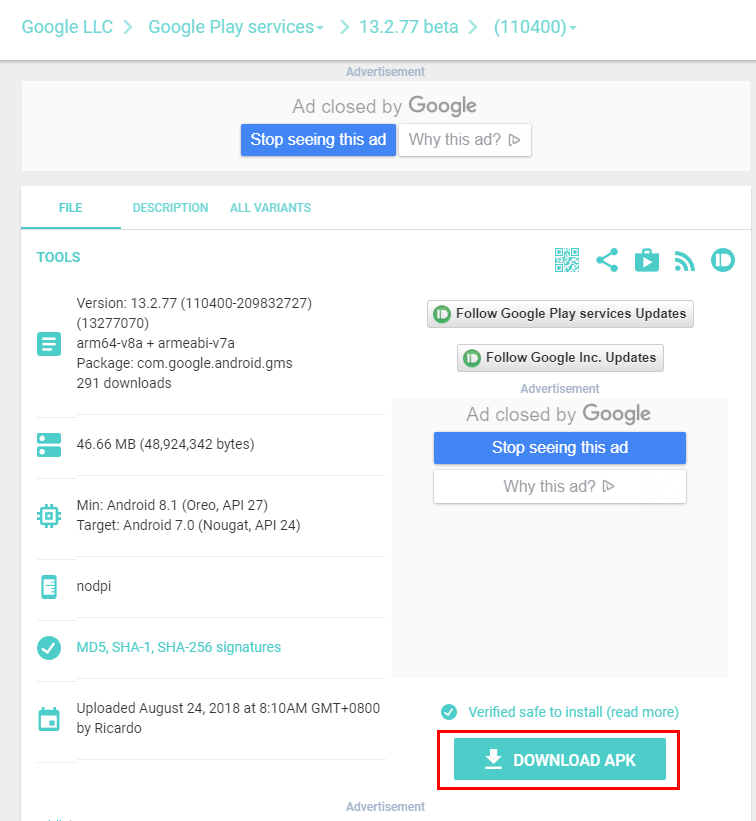
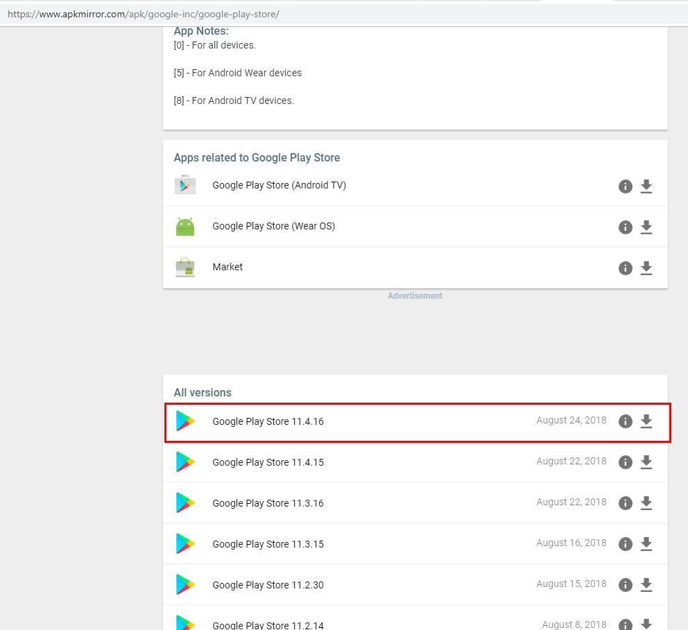

# 如何安装谷歌三件套
1. google服务框架
2. google play service
3. google play store  

## 1. 安装google服务框架

[google服务框架下载地址](https://www.apkmirror.com/apk/google-inc/google-services-framework/)

**注意一定要选择你的安卓系统版本的服务框架，根据文件名字来找。**

注意：1：软件安装最低系统版本，在手机的设置中关于本机可以查看到
2：无脑选择nodpi就行，如果讲究点可以谷歌搜索关键机《手机分辨率》《nodpi》

## 2. google play service

[google play service下载地址](https://www.apkmirror.com/apk/google-inc/google-play-services/)

安装适合自己手机芯片，系统以及分辨率的版本

3查看方式：谷歌搜索关键词《骁龙855plus是 v7a v8a》

也可以参考链接

[高通骁龙组件列表 - 维基百科，自由的百科全书](https://zh.wikipedia.org/wiki/高通驍龍元件列表#骁龙855/855_Plus/8cx/SQ1/8cx_Gen2/860)

[bujj博客 - arm64-v8a 与 armeabi-v7a 的区别，以及查看自己手机是哪种类型](https://www.bujj.org/index.php/2024/02/23/589/)

举例

在wiki上面显示如下

即骁龙855芯片是armv8架构，选择带有arm64-v8a字样的软件即可。

## 3. google play store

[google play store下载地址](https://www.apkmirror.com/apk/google-inc/google-play-store/)

**All Versions里面选择第一个最新版本就可以了**

注：下载文件可能是apkm，需要使用专门软件进行安装

[APKMirror - Free APK Downloads - Free and safe Android APK downloads](https://www.apkmirror.com/)

